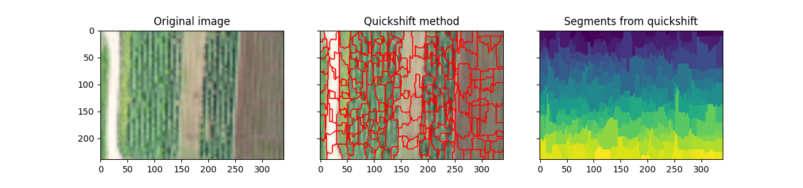

# Soil Segmentation Code Analysis
It is the first step to port the application on the ZCU102: learning what the algorithm does.
## Index
- [YCbCr_test](#ycbcr_testpy)
- [HSV_test](#hsv_testpy)
- [Histogram_test](#histogram_testpy)
- [Contour_test](#contour_testpy)
- [Otsu_segmentation_test](#otsu_segmentation_testpy)
- [Segmentation_test](#segmentation_testpy)
- [Soil segmentation](#soil_segmenationpy)

## YCbCr_test.py
This script converts the input image in YCbCr color space. Also it shows how to use `view_as_block` of `skimage.util`. Block views can be incredibly useful when one wants to perform local operations on non-overlapping image patches. [Skimage](https://scikit-image.org/) is a collection of algorithms for image processing.

This script:
 1. opens an image with  `imread`;
 2. creates a block view of the image in blocks of 32x32x1. **Be careful that smaller are the blocks and bigger and larger the resulting image will be but, on the other hand, bigger are the blocks, smaller the resulting image will be and with a worse resolution.**
    ```python
    view = view_as_blocks(image, (32, 32, 1))
    # print(view.shape) ------- (114, 171, 3, 32, 32, 1) that is a concatenation (new_image, shape)
    ```
    For example, if the rgb image is of 3648x5472x3 px the view_as_block image will be of 114x171x3: *3648/32=114, 5472/32=171, 3/1=3*.
 3. Then the image is flattened:
    ```python
    flatten_view = view.reshape(view.shape[0], view.shape[1], view.shape[2], -1)  # -1 one shape dimension
    # print(flatten_view.shape) ------- (114, 171, 3, 1024) (32, 32, 1) are collapsed in 1024
    ```
 4. Then, the algorithm starts. It consists of three main parts: [mean()](https://numpy.org/doc/stable/reference/generated/numpy.mean.html?highlight=mean), [max()]() and [median()](https://numpy.org/doc/stable/reference/generated/numpy.median.html?highlight=median#numpy.median) functions of numpy library which compute the arithmetic mean, get max value and comput the median along the specified axis.
    ```python
    mean_view = np.mean(flatten_view, axis=3)
    max_view = np.max(flatten_view, axis=3)
    median_view = np.median(flatten_view, axis=3)
    # they are arrays of 114x171x3 pixels. Each pixel contains the mean, max and median value of a block respectively
    # np.mean()
    ```
 5. Finally the images (mean_view, max_view and median_view) are plotted in different channels. In particular the image is converted in YCbCr color space using `rgb2ycbcr` from `skimage.color`:
    - Y channel
    - Cb channel
    - Cr channel
    - RGB channel


## HSV_test.py
It does the same thing of the program above but instead of plotting in YCbCr color profile, it plots now the images in HSV color profile. All the steps are similar.

## Histogram_test.py
Also in this script the steps are similar:
 1. image reading with  `imread`;
 2. creates a block view of the image in blocks of 32x32x1:
    ```python
    view = view_as_blocks(image, (32, 32, 1))
    # print(view.shape) ------- (114, 171, 3, 32, 32, 1) that is a concatenation (new_image, shape)
    ```
 3. Then the image is flattened:
    ```python
    flatten_view = view.reshape(view.shape[0], view.shape[1], view.shape[2], -1)  # -1 one shape dimension
    # print(flatten_view.shape) ------- (114, 171, 3, 1024) (32, 32, 1) are collapsed in 1024
    ```
 4. [mean()](https://numpy.org/doc/stable/reference/generated/numpy.mean.html?highlight=mean), [max()]() and [median()](https://numpy.org/doc/stable/reference/generated/numpy.median.html?highlight=median#numpy.median) are computed.
    ```python
    mean_view = np.mean(flatten_view, axis=3)
    max_view = np.max(flatten_view, axis=3)
    median_view = np.median(flatten_view, axis=3)
    # they are arrays of 114x171x3 pixels. Each pixel contains the mean, max and median value of a block respectively
    # np.mean()
    ```
 5. The image is converted in HSV profile.
 6. The **contrast stretching** is applied on `value_img`.  
    ```python
    # Contrast stretching
    img = value_img
    p2, p98 = np.percentile(img, (2, 98))
    img_rescale = exposure.rescale_intensity(img, in_range=(p2, p98))
    ``` 
    - `percentile`: compute the q-th percentile of the data along the specified axis and returns the q-th percentile(s) of the array elements. The default axis is to compute the percentile(s) along a flattened version of the array.
    - `rescale_intensity`: rescale the intensity of the image starting from percentile.
    
    Now, the contrast of the image is improved, but it isn't the best.
 7. The image is **equalized** using [histogram equalization](https://scikit-image.org/docs/dev/api/skimage.exposure.html?highlight=exposure#skimage.exposure.equalize_hist) method. *Note that the bins are the equal parts in which the histogram is divided for equalization*
    ```python
    # Equalization
    img_eq = exposure.equalize_hist(img) # it returns the image after histogram equalization
    ``` 
 8. The image is **equalized** using [adaptive equalization](https://scikit-image.org/docs/dev/api/skimage.exposure.html?highlight=exposure#skimage.exposure.equalize_adapthist), Contrast Limited Adaptive Histogram Equalization. An algorithm for local contrast enhancement, that uses **several histograms** computed over different tile regions of the image.  It is therefore suitable for improving the local contrast and **enhancing the definitions of edges** in each region of an image. 
    ```python
    # Adaptive Equalization
    img_adapteq = exposure.equalize_adapthist(img, clip_limit=0.03) # clip_limit (higher values give more contrast). 
    ```
 9. The results are displayed:
    - Low contrast image and its histogram
    - Contrast stretching image and its histogram
    - Histogram equalization image and its histogram
    - Adaptive equalization image and its histogram


## Contour_test.py
This script is similar to the [Histogram_test.py](histogram_testpy):
 1. image is read, divided into blocks (32x32x1) and flattened.
 2. the median view is computed and it is converted into HSV color space.
 3. Then **contrast stretching** is applied and **equalizations** are computed similar to Histogram_test.py but, instead of using the brightness profile color, it is used the **saturation profile** color.
 4. The results are displayed:
    - Low contrast image and its histogram
    - Contrast stretching image and its histogram
    - Histogram equalization image and its histogram
    - Adaptive equalization image and its histogram
 5. Then the [**gaussian** filter](https://scikit-image.org/docs/dev/api/skimage.filters.html?highlight=gaussian#skimage.filters.gaussian) is applied to the contrast stretched image:
    ```python
    # Applying gaussian filter, with sigma=3 (standard deviation)
    img = gaussian(img_rescale, 3)
    ```
 6. [Find contours](https://scikit-image.org/docs/dev/api/skimage.measure.html?highlight=contours#skimage.measure.find_contours) of the image:
    ```python
    # Find contours at a constant value of 0.8
    contours = measure.find_contours(img, 0.8)
    ```
    Returns a contourslist of (n,2)-ndarrays. Each contour is an ndarray of shape (n, 2), consisting of n (row, column) coordinates along the contour.

## Otsu_segmentation_test.py
This script implements the test of the [otsu segmentation algorithm](https://en.wikipedia.org/wiki/Otsu%27s_method):
 1. the image is read, divided into blocks (32x32x1) and flattened.
 2. the median view is computed and it is converted into YCbCr color space.
 3. the [threshold_otsu()](https://scikit-image.org/docs/dev/api/skimage.filters.html?highlight=threshold_otsu#skimage.filters.threshold_otsu) method is applied to the cr_img:
    ```python
    # Threshold value based on Otsu's method
    image = cr_img.copy()
    val = filters.threshold_otsu(image)
    ```  
 4. the flattened cr image is resized using [resize](https://scikit-image.org/docs/dev/api/skimage.transform.html?highlight=resize#skimage.transform.resize) function from skimage:
    ```python
    # resize the flattened image to match the original size
    image = resize(image, (_image_.shape[0], _image_.shape[1]))
    ```
 5. then the pixels of the image which have values greater than the threshold `val` are set to 255
    ```python
      # if the image[i] < val ---> mask_color[i]=true
      mask_color = image < val 
      mask = image < val
      # mask and mask_color are binary image
      _image_[mask_color, :] = 255
    ```

 6. cv2 library is used to display the images,[cvtColor()](https://docs.opencv.org/4.x/d8/d01/group__imgproc__color__conversions.html#ga397ae87e1288a81d2363b61574eb8cab), [imshow()](https://docs.opencv.org/4.x/df/d24/group__highgui__opengl.html#gaae7e90aa3415c68dba22a5ff2cefc25d). [resize()](https://docs.opencv.org/4.x/da/d54/group__imgproc__transform.html#ga47a974309e9102f5f08231edc7e7529d):
    ```python
    # Convert an image from RGB color to BGR (blue, green, red)
    cvtColor(_image, cv2.COLOR_RGB2BGR)
    # show the image rescaling it by 0.15 factor
    cv2.imshow("image", cv2.resize(cv2_image, (0, 0), fx=0.15, fy=0.15))

    cv2_rgb_masked = cv2.cvtColor(_image_, cv2.COLOR_RGB2BGR)
    cv2.imshow("image masked ", cv2.resize(
      cv2_rgb_masked, (0, 0), fx=0.15, fy=0.15))
    ```

## Segmentation_test.py
This script implements the test of segmentation to a set of images.
1. each image of the set 
   1. resized to a standard size (4800x6800)
   2. divided in blocks of 100x100
   3. flattened
2. the mean image is computed and then it is rescaled by 10 factor (480x680) and converted to a floating point format
3. The script computes **Felsenszwalb’s efficient graph based image segmentation** using [skimage.segmentation.felzenszwalb()](https://scikit-image.org/docs/dev/api/skimage.segmentation.html?highlight=segmentation#skimage.segmentation.felzenszwalb).
   ```python
   # scale sets an observation level - Higher scale means less and larger segments
   # sigma is the diameter of a Gaussian kernel, used for smoothing the image prior to segmentation

   def felzenszwalb_and_imshow(img):

      segments_fz = felzenszwalb(img, scale=100, sigma=0.5, min_size=2000)
      boundaries = mark_boundaries(img, segments_fz, color=(1, 0, 0))

      print(f"Felzenszwalb number of segments: {len(np.unique(segments_fz))}")
      print_img((img, boundaries, segments_fz), ("Original image", "Felzenszwalbs's method",
              "Segments from felzenszwalb"))

      return len(np.unique(segments_fz))  # return the number of segments
   ```

4. **Segments image using k-means clustering**, implemented by [skimage.segmentation.slic()](https://scikit-image.org/docs/dev/api/skimage.segmentation.html?highlight=segmentation#skimage.segmentation.slic):
   ```python
   # n_segments is the approximiate number of segments
   # comactness balances color proximity and space proximity. Higher values give more weight to space proximity, making superpixel shapes more square/cubic
   def slic_and_imshow(img):
    segments_slic = slic(img, n_segments=250,
                         compactness=10, sigma=1, start_label=1)
    boundaries = mark_boundaries(img, segments_slic, color=(1, 0, 0))
    
    print(f"SLIC number of segments: {len(np.unique(segments_slic))}")
    print_img((img, boundaries, segments_slic), ("Original image", "K-means clustering (slic)", "Segments from l-means clustering"))

    return len(np.unique(segments_slic))

   ```
5. **Segments image using quickshift clustering - the quickshift mode-seeking algorithm**, implemented by [skimage.segmentation.quickshift()](https://scikit-image.org/docs/dev/api/skimage.segmentation.html?highlight=segmentation#skimage.segmentation.quickshift):
   ```python
   # ratio alances color-space proximity and image-space proximity
   # kernel_size width of Gaussian kernel used in smoothing the sample density
   # max_dist cut-off point for data distances. Higher means fewer clusters
   def quick_and_imshow(img):
      segments_quick = quickshift(img, kernel_size=3, max_dist=6, ratio=0.5)
      boundaries = mark_boundaries(img, segments_quick, color=(1, 0, 0))

      print(f"Quickshift number of segments: {len(np.unique(segments_quick))}")

      print_img((img, boundaries, segments_quick), ("Original image", "Quick method", "Segments from quickshift"))
      
      return len(np.unique(segments_quick))  
      
   ```

6. **Find edges in an image using the Sobel filter** using [skimage.filters.sobel()](https://scikit-image.org/docs/dev/api/skimage.filters.html?highlight=sobel#skimage.filters.sobel):
  ```python
   def sobel_and_imshow(img):
      segments_sobel = sobel(rgb2gray(img))

      print_img((img, segments_sobel), ("Original image", "Sobel filter"))

      return len(np.unique(segments_sobel))
  ```

7. **Find watershed basins in image flooded from given markers** using [skimage.segmentation.watershed)](https://scikit-image.org/docs/dev/api/skimage.segmentation.html?highlight=segmentation#skimage.segmentation.watershed):
  ```python
   # markers the desired number of markers 
   def watershed_and_imshow(img):
      gradient = sobel(rgb2gray(img))
      segments_watershed = watershed(gradient, markers=250, compactness=0.001)
      boundaries = mark_boundaries(img, segments_watershed, color=(1,0,0))
      
      print(f"Watershed number of segments: {len(np.unique(segments_watershed))}")
      
      print_img((img, boundaries, segments_watershed), ("Original image", "Watershed method", "Segments from watershed"))
      
      return len(np.unique(segments_watershed))
      
   ```





## Soil_Segmentation.py
This script applies the otsu segmentation algorithm. The output images are available in [SOIL_SEGMENTED_IMAGES](../SOIL_SEGMENTED_IMAGES) and [SOIL_SEGMENTED_MASKS](../SOIL_SEGMENTED_MASKS) directories,