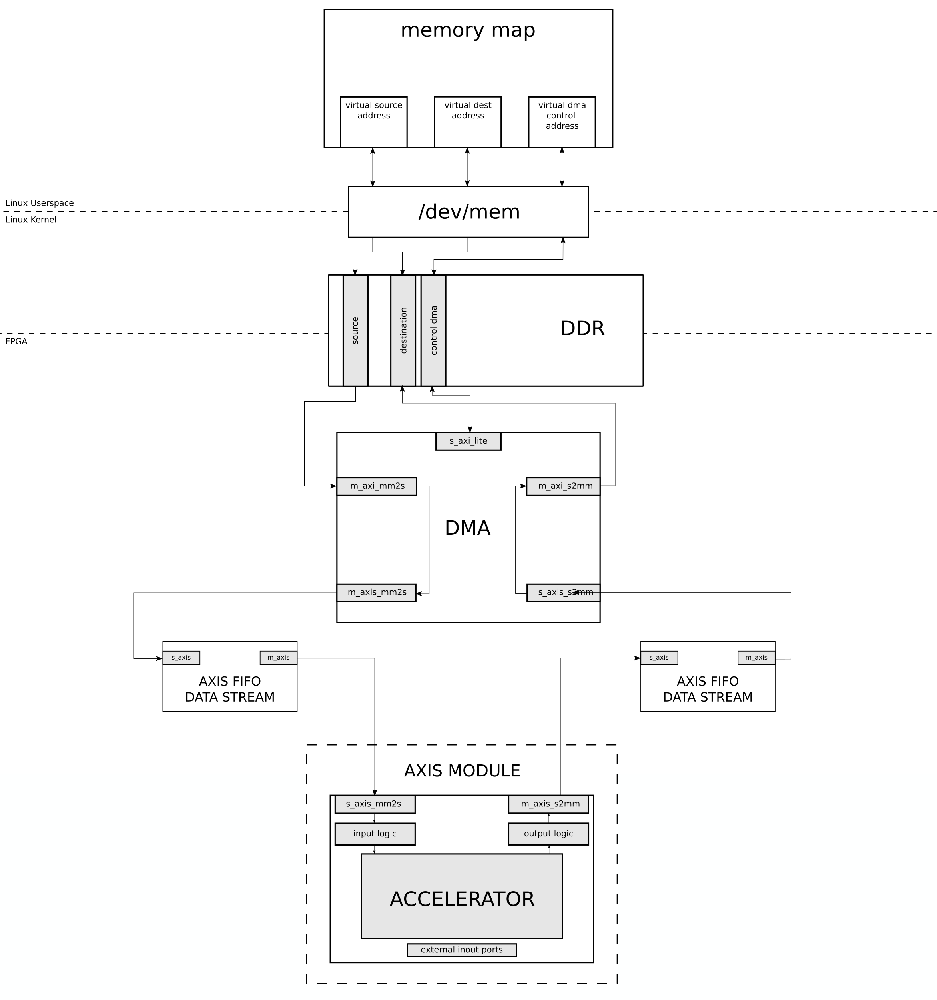

# Communication Management (PS-PL)
The communication management among the PS and PL sides is one of the most important functionalities needed by a heterogneous system OS (See [How to create a Yocto OS on US+ ZCU102](https://mdc-suite.github.io/miscellaneous/yoctofpga) to create one). 

The Direct Memory Access (DMA) is a method for accessing the main memory (DDR) without tying up the CPU, therefore, the DMA leaves it available to perform other operations during the read/write cycle.

The whole application is divided in two main part:
 - **Hardware application**, running on FPGA, made up by AXI DMA and a custom hardware accelerator used to speed up the most onerous operations
 - **Software application**, running on OS, delegated for control operations, like communication management, and the least onerous operations

**This guide is partially derived by [Introduction to using axi dma in embedded linux](https://www.hackster.io/whitney-knitter/introduction-to-using-axi-dma-in-embedded-linux-5264ec#things) and it is adapted to use the DMA by Yocto linux OS with a custom IP*

## Schematic


## Hardware application
The ZynqMP processing system DMA channels built-in allow only memory-to-memory transfers, not stream-to-memory or memory-to-stream transfers. Custom IPs like accelerators, peripherals, and any other hardware block, which are "stream oriented", needs a specific interface: the AXI DMA IP. It allows any block with the AXI Stream (AXIS) interface to access the DDR for receiving and sending data -- in other words, it allows the communication between PS and PL. Thus, the hardware application consists of four main blocks:
 - AXI DMA IP block
 - AXI4-Stream Data FIFO input*
 - AXI4-Stream Data FIFO output*
 - Custom IP block with AXIS interface

**FIFOs are not strictly necessary, but they allow to speed up and to make easier the communication. In fact, they receive data from DMA, make them available to logic with a known interface, and send processed data back to DMA*

### Creating the custom IP block
The first step to develop such hardware application is to create the custom IP block with an AXIS interface.

Top module interface:
```verilog
module axis_top_hw #
    (parameter C_AXIS_TDATA_WIDTH = 8) (
    // User inputs

    // User outputs


    /*
     * AXIS slave interface (input data)
     */
    input  wire                   s00_axis_aclk,
    input  wire                   s00_axis_aresetn,
    input  wire [C_AXIS_TDATA_WIDTH-1:0]  s00_axis_tdata, // input data
    input  wire                   s00_axis_tvalid,        // input data valid 
    output wire                   s00_axis_tready,        // slave ready
    // input  wire                s00_axis_tlast,
    
    /*
     * AXIS master interface (output data)
     */
    input  wire                   m00_axis_aclk,    
    input  wire                   m00_axis_aresetn,
    output wire [C_AXIS_TDATA_WIDTH-1:0]  m00_axis_tdata, // output data
    output wire                   m00_axis_tvalid,        // output data valid
    input  wire                   m00_axis_tready,        
    output wire                   m00_axis_tlast          // data last signal
);
``` 
In [axis_fifo_small_easy_hw_block.v](axis_fifo_small_easy_hw_block.v) I used this interface and I connected a [FIFO](fifo_small.v), a [hardware block](core_easy_hw_block.v) and some external ports (leds, pushbuttons, and switches) together.

Before moving on to the next step, it is necessary to package the top module into an IP block.
From the Vivado project, open 'Tools' and then 'Create and Package new IP'.


Click next and then select 'Package your current project'.


Choose the IP location and click 'OK'.


Finally click 'Finish' and the 'tmp' project will be opened. Make sure the ports and the interfaces are properly connected.


Usually the ports are automatically mapped, but if not, click '+' and add master and slave interface.
Interface definition 'axis_rtl', mode 'master'.


Map 'TDATA', 'TLAST', 'TVALID' and 'TREADY'.


For the slave interface repeat the last two steps mapping 'TDATA', 'TVALID' and 'TREADY''.

Click either 'Re-Package IP' or  'Package IP'.


Finally, add the IP repository.


### Connect DMA, custom IP and Processing System
Once the custom IP is created and added to the repository, open a new project, create a new Block Design and connect all components.
 1. Add **Zynq UltraScale+ MPSoc** IP block for the PS side, click run block automation (Apply Board Preset) and edit 'PS-PL Configuration' checking 'AXU HP0 FPD'.
  
  
 2. Add **AXI Direct Memory Access** IP block, uncheck 'Enable Scatter Gather Engine' (leave the remaining options as default) and click run block automation again (check 'All Automation').
  
  
 3. Add the input and output **AXI4-Stream Data FIFO**, and the custom IP with AXIS interface.
     - Connect the Master interface of DMA to Slave interface of input FIFO (M_AXIS_MM2S and S_AXIS);
     - Connect the Master interface of input FIFO to Slave interface of custom IP (M_AXIS and  s00_axis);
     - Connect the Master interface of custom IP to Slave interface of output FIFO (m00_axis and  S_AXIS);
     - Connect the Master interface of output FIFO to Slave interface of DMA (M_AXIS and  S_AXIS_S2MM);
     - Run connection automation.

    
 4. If the custom IP has external input/output ports, right click and then 'Make External'.
    

Once all components are connected in the block design, go to sources, right click on 'design_file_name' and select Create HDL wrapper -- it will create a *.v version of the Block Design.

### Download and edit XDC for direct connection to external ports
If the custom IP has external ports, download the XDC from the official site and connect **only** the external ports.

### Generate bitstream
Finally run synthesis, implementation and bitstream. Make sure that neither critical warnings nor errors appear.
To use the bitstream by the Linux Userspace, please see: [Yocto FPGA programming](https://mdc-suite.github.io/miscellaneous/yoctofpga#fpga-programming).

## Software application on OS
The core is a C application which loads the accelerator and uses the memory map engine to control the DMA for communication. It manages the communication writing and reading the DMA control registers of the DDR. Source code: [dma_sample_app.c](dma_sample_app.c).
