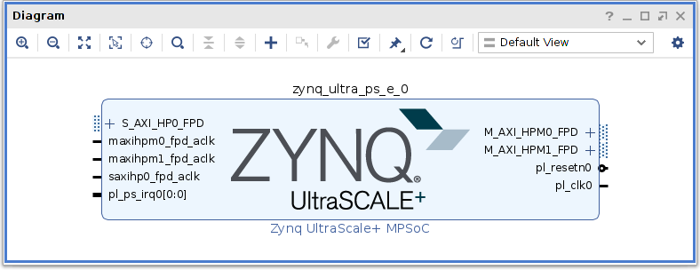

# Communication Management (PS-PL)
The communication management among the PS and PL sides is one of the most important functionalities needed by a heterogeneous system OS ([How to create a Yocto OS on US+ ZCU102](https://mdc-suite.github.io/miscellaneous/yoctofpga)), in order to develop software applications which exploit the hardware acceleration of FPGAs.

The Direct Memory Access (DMA) is a method for accessing the main memory (DDR) without tying up the CPU. Therefore, it leaves the CPU available to perform other operations during the read/write cycle. For this reason it has been used as the method of communication between Processing System (PS) and Programmable Logic (PL).

This document presents how to develop a heterogeneous application, divided it two main part, whose communication has been implemented using [AXI DMA](https://www.xilinx.com/support/documentation/ip_documentation/axi_dma/v7_1/pg021_axi_dma.pdf) and [AXI-Stream interface modules](https://www.xilinx.com/support/documentation/ip_documentation/ug761_axi_reference_guide.pdf):
 - **Hardware application**, running on the FPGA, made up by a custom hard-
ware accelerator used to speed up the most onerous operations
 - **Software application**, running on the CPU, delegated for control operations,
like communication management, and the least onerous operation


**This guide is partially derived by [Introduction to using axi dma in embedded linux](https://www.hackster.io/whitney-knitter/introduction-to-using-axi-dma-in-embedded-linux-5264ec#things) and it has been adapted to use the DMA by Yocto linux OS with a custom accelerator*

## Schematic


## Communication Protocol
The software application is a C application based in the Linux Userspace. It accesses the DDR, through /dev/mem file, using [mmap()](https://man7.org/linux/man-pages/man2/mmap.2.html) , it handles the DMA control addresses, and it write data (MM2S) in the source addresses, wait the hardware application and, once data comes back, it reads data (S2MM) from destination addresses.

On hardware side, the DMAs access the DDR directly through their Slave AXI Lite interface (s axi lite). The MM2S DMA reads data from DDR and sends them to the accelerator through the input AXI FIFOs Data Stream, at this point data reaches the accelerator. Processed data are sent back to the output AXI FIFOs Data Stream, and then to S2MM DMAs which will write data in the DDR.

In order to evaluate the communication, a hardware accelerator which implements the Advanced Encryption Standard with 256 bit key and 128 bit text (AES256) has been used.

# Hardware application
The final hardware application is a *.bin file, generated by [Vivado IP integrator](https://www.xilinx.com/support/documentation-navigation/design-hubs/dh0009-vivado-using-ip-integrator-hub.html), which can be loaded by the software application, Section 3. The ZynqMP processing system DMA channels built-in allow only memory-to-memory transfers, not stream-to-memory or memory-to-stream transfers. Custom IPs like accelerators,peripherals, and any other hardware block, which are ”stream oriented”, needs a specific interface: the AXI DMA IP. It allows any block with the AXI Stream (AXIS) interface to access the DDR for receiving and sending data – in other words, it allows the communication between PS and PL. Thus, the hardware application consists of four main blocks:
 - AXI DMA IP blocks
 - AXI4-Stream Data input FIFOs 3
 - AXI4-Stream Data output FIFOs
 - Custom IP block with AXIS interface

The steps needed to create such application are:
1. Create a custom IP block
2. Connect DMA, custom IP and Processing System blocks
3. Edit XDC (external ports only)
4. Generate bitstream

**FIFOs are not strictly necessary, but they allow to speed up and to make easier the communication. In fact, they receive data from DMA, make them available to logic with a known nterface, and send processed data back to DMA*

## Create a custom IP block
The first step is to create the custom IP block with an AXIS interface, starting from
a Verilog module.

Top module interface:
```verilog
module axis_top_hw #( parameter C_AXIS_TDATA_WIDTH = 32)
(
  // User inputs

  // User outputs

  /*
  * AXIS slave interface ( input data )
  */
  input wire  s00_axis_aclk,
  input wire  s00_axis_aresetn,
  input wire [ C_AXIS_TDATA_WIDTH -1:0] s00_axis_tdata,  // input data
  input wire  s00_axis_tvalid,                           // input data valid
  output wire  s00_axis_tready,                          // slave ready
  // input wire  s00_axis_tlast,                         // not used

  /*
  * Other AXIS slaves
  */
  // input wire  s0i_axis_aclk,
  // input wire  s0i_axis_aresetn,
  // input wire [ C_AXIS_TDATA_WIDTH -1:0] s0i_axis_tdata, // input data
  // input wire  s0i_axis_tvalid,                           // input data valid
  // output wire  s0i_axis_tready,                          // slave ready

  /*
  * AXIS master interface ( output data )
  */
  input wire  m00_axis_aclk,
  input wire  m00_axis_aresetn,
  output wire [ C_AXIS_TDATA_WIDTH -1:0] m00_axis_tdata, // output data
  output wire  m00_axis_tvalid,                           // output data valid
  input wire  m00_axis_tready,                            // output ready
  output wire  m00_axis _tlast                            // data last signal

  /*
  * Other AXIS masters
  */
  // input wire  m0i_axis_aclk,
  // input wire  m0i_axis_aresetn,
  // output wire [ C_AXIS_TDATA_WIDTH -1:0] m0i_axis_tdata, // output data
  // output wire  m0i_axis_tvalid,                          // output data valid
  // input wire  m0i_axis_tready,                           // output ready
  // output wire  m0i _axis_t last                          // data last signal
  );

  // External inputs ( switches , pushbuttons etc .)


  // Input slave logic

  // Accelerator

  // Output master logic


  // External outputs ( leds etc .)
``` 
[axis_aes256.v](axis_aes.v) provides a real example of such top module template. It has three 8-bit input data (text_data, key_data, and rc_data) and one 8-bit output data (chiped_text_data). All data comes from CPU and the output is sent to CPU, so, the module interface is compounded by 3 axis slaves and 1 axis master for the output. The input logic consists of 3 input FIFOs and the output logic consists of an output FIFO.

The m0i_axis_tlast signal is very important, since it signals to the DMA that m0i_axis_tdata is the last one, allowing the DMA to send the interrupt properly. So, it is necessary to rise it when the last data has been sent. Specifically, in axis aes256.v, the tlast signal is handled by a counter and it is raised while the 16th output is sending.


Once the verilog top module is written, it is necessary to package it into an IP block. To do that from the Vivado project, open ’Tools’ and then choose ’Create and Package new IP’.


Click next and then select ’Package your current project’, choose the IP location and click ’Finish’, the ’tmp’ project will be opened. At this point, make sure the ports and the interfaces are properly connected.


Usually the ports are automatically mapped, but if not, click ’+’ and add master and slave interface. Choose the interface definition (’axis rtl’, mode ’master’ or ’slave’), and map ’TDATA’, ’TLAST’ (master only), ’TVALID’ and ’TREADY’.


Finally, package the IP.


## Connect DMA, custom IP and Processing System
Once the custom IP has been created and added to the repository IP Catalog, open a new project, create a new Block Design and connect all components.
 1. Add **Zynq UltraScale+ MPSoc** IP block for the PS side, click run block automation (Apply Board Preset) and edit 'PS-PL Configuration' checking 'AXI HP0 FPD'.
   
   
 2. Add the **AXI Direct Memory Access** IP block, disable 'Enable Scatter Gather Engine' (leave the remaining options as default) and click run block automation again (check 'All Automation'). The schematic shows a system with only one DMA, but if your custom IP has multiple slaves and/or multiple masters, you need to add a "input MM2S DMA" ('Enable write channel' disabled) for each slave and a "output S2MM DMA" ('Enable read channel' disabled) for each master.
   
   
 3. Add the input and output **AXI4-Stream Data FIFO** (one for each slave/master interface respectively), and the custom IP with AXIS interface.
     - Connect the Master interface of DMA to Slave interface of input FIFO (M_AXIS_MM2S and S_AXIS);
     - Connect the Master interface of input FIFO to Slave interface of custom IP (M_AXIS and  s00_axis);
     - Connect the Master interface of custom IP to Slave interface of output FIFO (m00_axis and  S_AXIS);
     - Connect the Master interface of output FIFO to Slave interface of DMA (M_AXIS and  S_AXIS_S2MM);
     - Run connection automation.

    
 
 4. If the custom IP has external input/output ports, right click and then 'Make External'.
    
 
 5. Validate block design.

Once all components are connected save the block design, go to sources, right click on 'design_file_name', and choose 'Create HDL wrapper' (Let Vivado manage wrapper and auto-update) -- it will create a *.v version of the Block Design. If you edit the block design, re-run 'Validate block design' before creating the wrapper.


## Generate bitstream
If the custom IP has external ports, download the XDC from the official site and connect **only** the external ports.
Run synthesis, implementation and bitstream (make sure that in project settings bin file generation has been selected). Make sure that neither critical warnings nor errors appear.
To use the bitstream by the Linux Userspace, please see: [Yocto FPGA programming](https://mdc-suite.github.io/miscellaneous/yoctofpga#fpga-programming).

# Software application on OS
In order to use the bitstream by the Linux Userspace, please see [Yocto FPGA programming](https://mdc-suite.github.io/miscellaneous/yoctofpga#fpga-programming). The core is a C application which loads the accelerator and uses the memory map engine to control the DMA for communication, [AXI DMA v7.1 - AXI DMA Register Address Map](https://www.xilinx.com/support/documentation/ip_documentation/axi_dma/v7_1/pg021_axi_dma.pdf). It manages the communication writing and reading the DMA control registers of the DDR. Source code: [dma_sample_app.c](dma_sample_app.c).
1. Load accelerator using fpgautil.
```C
system ("fpgautil -b aes256_dma.bin");
```
2. Open the ddr memory.
```C
int ddr_memory = open ("/dev/mem", O_RDWR | O_SYNC);
```
3. Use mmap() for mapping the DMA control addresses and data addresses.
4. Write data in source data virtual addresses.
5. Reset, halt the DMAs, and enable all interrupts.
6. Write the source and destination addresses.
7. Run the MM2S and S2MM channels, and the transfer length.
8. Wait for MM2S and S2MM synchronizations.
9. Unmap virtual addresses and close the ddr memory.

dma_sample_app.c is a first prototype to test the communication via mmap and DMA, I have planned to implement API to simplify it further.